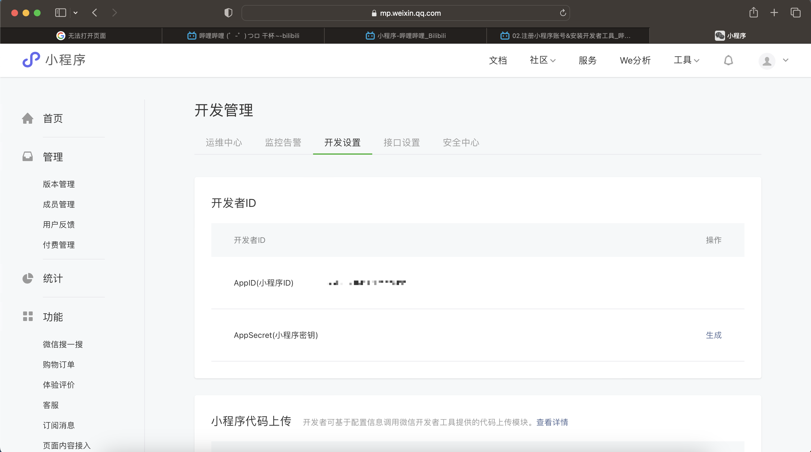

b站网课：https://www.bilibili.com/video/BV1834y1676P/?p=3&spm_id_from=pageDriver&vd_source=ee6c2435e5ca938edef64a215fab1fac

## 准备工作
### 注册小程序账号
注册小程序账号: https://mp.weixin.qq.com

### 小程序ID
小程序ID: 登陆以后点击左侧“开发” -> “开发管理“，选择右侧“开发设置“

### 安装开发者工具
安装开发者工具: https://developers.weixin.qq.com/miniprogram/dev/devtools/stable.html

## 小程序项目结构
[小程序项目结构](notes/小程序%20代码结构.md)

## 小程序组件
[小程序组件](notes/小程序%20组件.md)

## 小程序 模版与配置
[小程序 模版与配置](notes/小程序%20模版与配置.md)

## 小程序 视图与逻辑
[小程序 视图与逻辑](notes/小程序%20视图与逻辑.md)
1. 实现页面之间如何跳转
2. 实现下拉刷新效果
3. 实现上拉加载更多效果
4. 常用的生命周期函数

## 小程序 基础加强
[小程序 基础加强](notes/小程序%20基础加强.md)
1. 学习如何自定义小程序组件
2. 组件中 `behavior` 的作用
3. 安装和配置 `vant-wweapp` 组件库
4. 使用 `MobX` 来共享全局数据
5. 对小程序 API 进行 Promise 化

## 未解决的问题
记录了学习时没弄懂的地方，需要额外查些资料。以及还没做完的笔记
