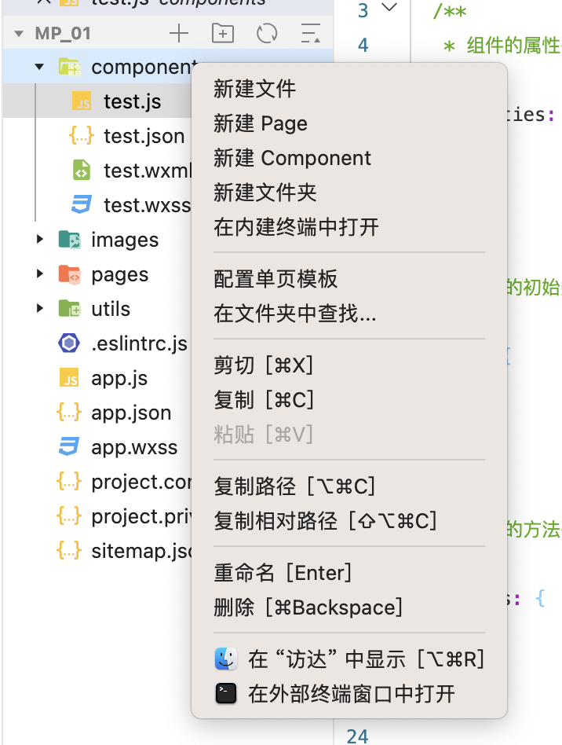
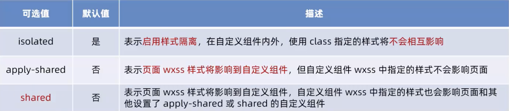
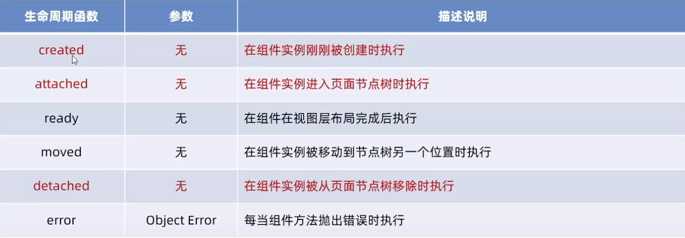
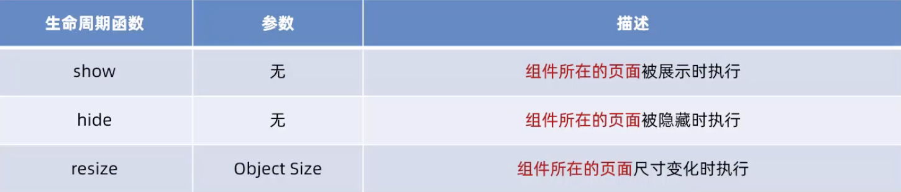
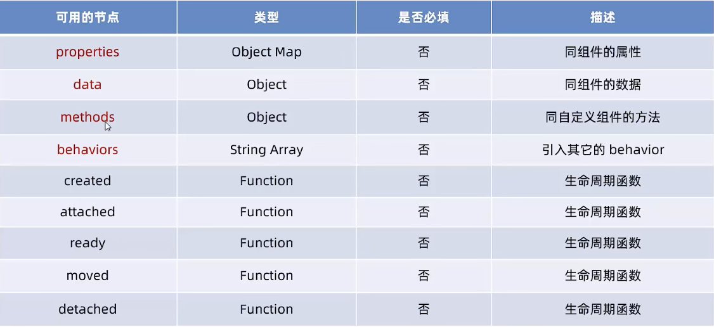
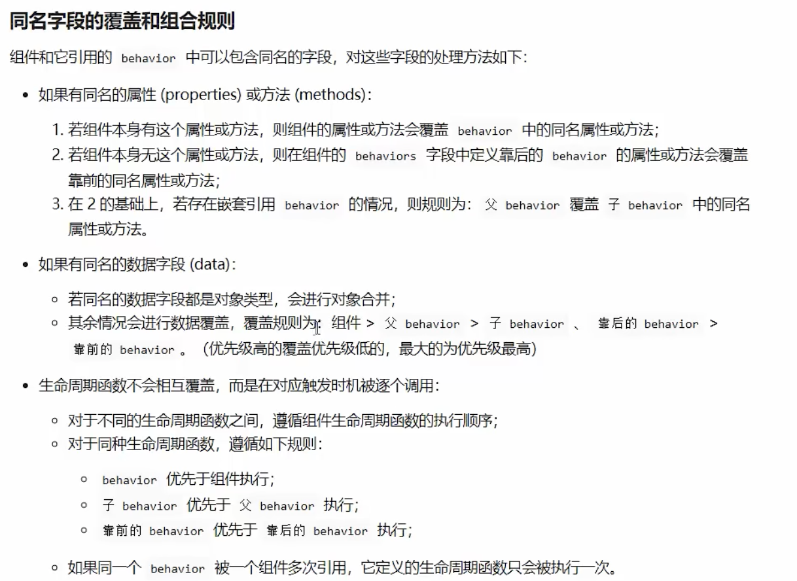
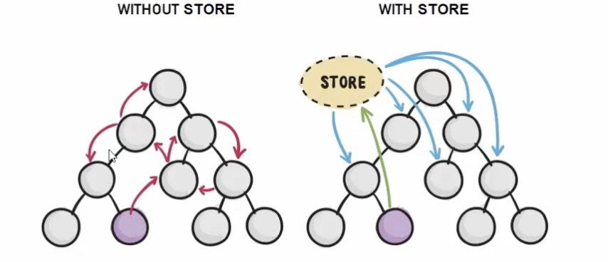
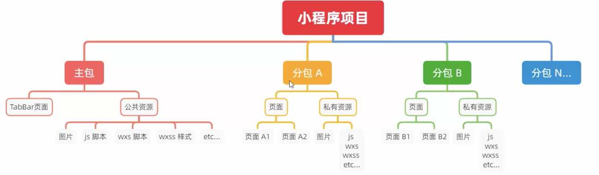

#基础加强
[TOC]

## 自定义组件
### 创建组件
根目录创建components文件夹 -> 右键components -> 新建Component



### 引用组件

```js
// .json
// 如果在app.json里写，那就是全局定义
"usingComponents": {
      "test": "../../components/test"
  }

// .wxml
<test></test>
```

### 组件与页面区别
1. 组件里有 `"component": true,`
2. 组件的事件处理函数必须定义到 `method` 节点中

### 组件样式隔离
1. `app.wxss` 中全局样式对组件无效
2. 页面样式与组件样式互不影响
3. 只有 class选择器受到样式隔离影响。id选择器，属性选择器，标签选择器不受样式隔离影响  
E.g.
如果在 `app.wxss` 里定义`text: ...` , 那么组件里的 `text` 会受到影响

4. 修改样式隔离

```json
// 组件json文件
"styleIsolation": "isolated"

// 组件js文件
  options: {
      styleIsolation: "isolated"
  }
```


### 组件properties
```js
    // js
  properties: {
      max: {
          type: Number,
          value: 10
      },
      min: Number
  },

    // wxml
  <test max="100"></test>
```

### 纯数据字段
**定义** 不用于渲染界面的数据   
**好处** 提升页面更新性能  
**用法**
用 pureDataPattern 和正则表达式来定义，所有以下划线开头的数据，都是纯数据字段
```js
Component({
    options: {
        pureDataPattern: /^_/
    },
  /**
   * 组件的属性列表
   */
  properties: {
      max: {
          type: Number,
          value: 10
      },
      _min: Number
  },
}
```
### 组件监听器
用 `observers`
```js
  data: {
      n1: 0,
      n2: 0,
      sum: 0
  },
  observers: {
      "n1, n2": function(n1, n2){
          this.setData({sum: n1 + n2})
      }
  },
```

### 组件生命周期

**最主要的三个是 `created`, `attached`, `detached`**

1. `created`
   1. 组件刚被创建好的时候
   2. 不能调用setData
   3. 用于给组件的this添加自定义属性字段

2. `attached`
   1. 组件完全初始化完毕
   2. 绝大多数工作在这个时候运行
3. `detached`
   1. 组件离开页面节点
   
**自定义组件生命周期函数**
```js
lifetimes: {
    created() {
        ...
    },
    attached() {
        ...
    }
}
```

### 组件所在页面生命周期
`show`, `hide`, `resize`



```js
pageLifetimes: {
    show: function(){
        ...
    },
    hide: function(){
        ...
    }
}
```

### 组件插槽
#### 单个插槽
```html
<!-- 组件封装着 -->
<view>
    <view>这是组件内部节点</view>
    <slot></slot>
</view>


<!-- 组件调用者 -->
<component>
    <!-- 这部分内容会被放置在slot位置 -->
    <view>这是插入到slot的内容</view>
</component>
```

#### 多个插槽
**启用多个插槽**
```json
options: {
        multipleSlots: true
    },
```

**用法**
```html
<!-- 组件封装着 -->
<view>
    <slot name="before"></slot>
    <view>这是组件内部节点</view>
    <slot name="after"></slot>
</view>


<!-- 组件调用者 -->
<component>
    <!-- 这部分内容会被放置在slot位置 -->
    <view slot="before">这是插入到slot name=before的内容</view>
    <view slot="after">这是插入到slot name=after的内容</view>
</component>
```

### 组件通信
#### 属性绑定
之前讲过，组件properties

#### 事件绑定
`父组件 js文件`
```js
syncCount(e){
    console.log("e.detail.value")
}
```

`父组件 wxml`
注意不用花括号
```html
<test-component bind:sync=syncCount></test-component>
```

`子组件`
```js
// wxml
<button bindtap="addCount">+1</button>

// js
methods: {
    addCount(){
        this.setData({count: this.data.count + 1})

        this.triggerEvent('sync', {value: this.properties.count})
    }
}

```

#### 获取组件实例
> 在父组件中可调用 `this.seleceComponent` 来获取组件实例，需要提供一个 class选择器 或 id选择器


```js
// wxml
<test-component class="componentA"></test-component>


//js
getComponent(){
    const child = this.seleceComponent(".componentA")

    console.log(child.properties)
}
```

### 组件behaviors
用来实现代码共享的一种方式  
一个组件可以调用多个behavior，behavior里也可以调用behavior

#### 创建behavior
根目录新建文件夹behaviors，新建js文件
```js
module.exports = Behavior({
    properties: {},
    data: {
        username: "zs"
    },
    methods: {}
})
```
#### 调用behavior
```js
// .js
const myBehavior = require('../behaviors/my-behavior')

Component({
    behaviors: [myBehavior],
}

// .wxml
<view>behavior里的username: {{username}}</view>
```
#### behavior 中所有可用节点


#### 同名字段覆盖和组合规则

   

## 使用npm包
### 小程序对npm的支持与限制
1. 不支持依赖于Node.js内置库的包
2. 不支持依赖于浏览器内置对象的包
3. 不支持依赖于C++插件的包

### Vant Wweapp
官方文档: https://vant-contrib.gitee.io/vant-weapp/#/home

安装步骤  
https://vant-contrib.gitee.io/vant-weapp/#/quickstart

使用方式
```js
// app.json
    "usingComponents": {
        "van-button": "@vant/weapp/button/index"
    },

// wxml
<van-button type="primary">按钮</van-button>
```

### css修改vant weapp组件样式
根据[官方配置文件](https://github.com/youzan/vant-weapp/blob/dev/packages/common/style/var.less)，找到需要修改的变量，然后在 `wxss`文件里修改。例如下面是修改警告按钮的样式
`app.wxss`
```css
page{
    /* 定制警告按钮的背景颜色和边框颜色 */
    --button--danger-background-color: #C00000;
    --button-danger-border-color: #D60000;
}
```

### API Promise化
**定义**
通过额外的配置，将官方提供的、基于回调函数的异步API，升级为机遇Promise的异步API，提高代码的可读性

#### miniprogram-api-promise
> 实现API Promise化主要依赖于`miniprogram-api-promise` 库

**安装：** `npm i --save miniprogram-api-promise@1.0.4`

> 安装后记得先删除miniprogram_npm，再重新构建npm

**实现**
```js
// 在小程序入口文件 app.js 中，只需要调用一次promisefyAll()， 即可实现异步 API 的 Promise 化
import { promisifyAll } from "miniprogram-api-promise"

const wxp = wx.p = {}
promisifyAll(wx, wxp)
```

之后使用 `wx` 里的异步函数时，应该改用 `wx.p`
E.g.
```js
wx.request() 改为 wx.p.request()
```

## 全局数据共享 - MobX

### 安装 MobX 相关的包

`npm install --save mobx-miniprogram@4.13.2 mobx-miniprogram-bindings@1.2.1`

> 记得先删除 miniprogram_npm 再构建npm

### 创建Store实例
创建store/store.js文件
```js
import { observable, action } from "mobx-miniprogram"

export const store = observable ({
    numA: 1,
    numB: 2,
    // get 方法
    get sum(){
        return this.numA + this.numB
    },
    // action 方法
    updateNumA: action(function (step){
        this.numA += step
    }),
    updateNumB: action(function (step){
        this.numB += step
    }),

})
```

### 在页面中使用Store
```js
// pages/home/home.js
import {createStoreBindings} from "mobx-miniprogram-bindings"
import {store} from "../../store/store"

Page({
    
    /**
     * * 生命周期函数--监听页面加载
    */
    onLoad(options) {
        this.storeBindings = createStoreBindings(this, {
            store,
            fields: ['numA', 'numB', 'sum'],
            actions: ['updateNumA']
        })
    },
    /**
     * 生命周期函数--监听页面卸载
     */
    onUnload() {
        this.storeBindings.destoryStoreBindings() 
    },
}
```

```html
<!--pages/home/home.wxml-->
<view>{{numA}}</view>
```

### 在组件中使用store
```js
// components/test.js
import {storeBindingsBehavior} from "mobx-miniprogram-bindings"
import {store} from "../store/store"

Component({
    behaviors: [storeBindingsBehavior],
    storeBindings: {
        store,
        fields: {
            // 这是三种绑定字段的方法
            numA: () => store.numA,
            numB: (store) => store.numB,
            sum: 'sum'
        },
        actions: {
            updateNumA: 'updateNumA'
        }
    },
     methods: {
      plusNumA(){
          this.updateNumA(1)
      }
  },
}
```

## 分包


小程序启动时会默认加载主包，下载主包内容。用户进入某个分包页面时，会下载分包资源

### 配置方式
```
// 小程序，目录结构
|---- app.js
|---- app.json
|---- app.wwxss
|---- pages         // 主包的所有页面
|    |---- index
|    |---- logs
|----packageA       // 第一个分包
|    |---- pages    // 第一个分包的所有页面
|    |    |---- cat
|    |    |---- dog
|----packageB       // 第二个分包
|    |---- pages
|    |    |---- apple
|    |    |---- banana
|---- utils
```

```json
// app.json
{
    "pages":[
        "pages/index",
        "pages/logs"
    ],
    "subpackages":[
        {
            "root": "packageA",
            "pages":[
                "pages/cat",
                "pages/dog"
            ]
        },{
            "root": "packageB",
            "name": "pack2",
            "pages":[
                "pages/apple",
                "pages/banana"
            ]
        }
    ]
}

```

### 独立分包
独立分包可以在不下载主包的情况下独立运行
只需要在json里加一行代码
```json
{
    "root": "packageB",
    "name": "pack2",
    "pages":[
        "pages/apple",
        "pages/banana"
        ]
}
```

### 引用原则
1. 独立分包、普通分包、主包之间是相互隔绝的，不能相互引用彼此的资源。
   1. 主包无法引用独立分包内的私有资源
   2. 独立分包不能引用主包内的公共资源

### 分包预下载
预下载分包的行为，会在进入指定的页面时触发。

```json
// json
{
    "preloadRule":{
        "pages/contact/contact":{   // 触发分包预下载的页面
            "network": "all",   // all 不限网络； wifi 仅wifi模式
            "packages": ["pkgA"]    // 可以通过 root 或 name 指定预下载哪些分包
        }
    }
}
```
