# 小程序 模版与配置
代码部分见 `../codes/mp_01`

[TOC]

## `WXML` 模版语法
### 数据绑定
1. 在 `data` 里定义数据
2. 在 `WWXML` 中使用数据

例：
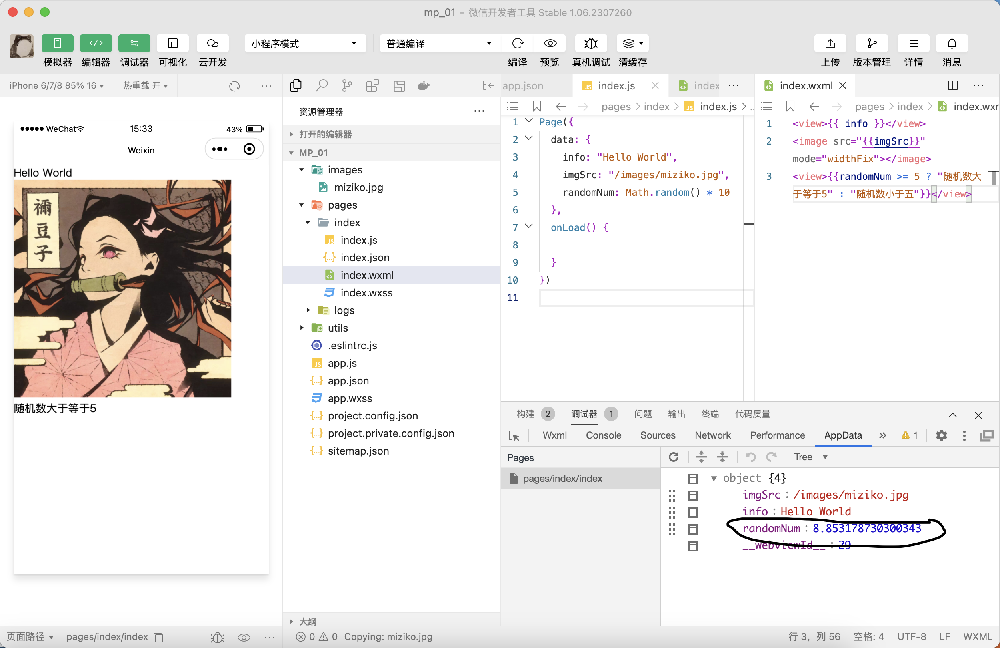

### 事件绑定
#### 常见事件
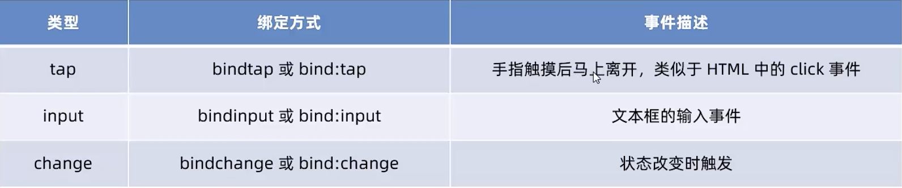
#### 事件对象(event)的属性
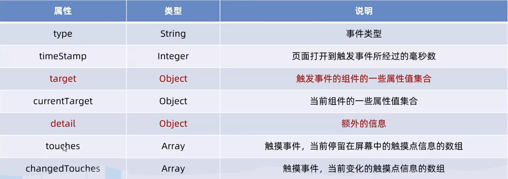

总结: 
* 最后input里应该是 `value="{{msg}}"`
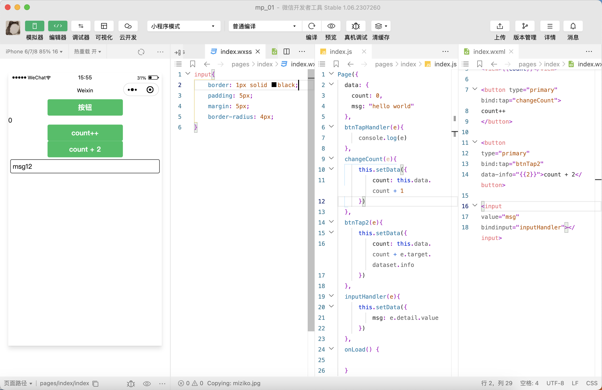

#### 条件渲染
* 注意格式 `<view wx:if="{{type === 'A'}}">A</view>`
* `block` 在渲染时不会渲染出任何组件
* `wx:if` 是以动态创建和删除的方式来隐藏组件
* `hidden` 是改变样式 `display: none\block`
* 频繁切换时建议用 `hidden`
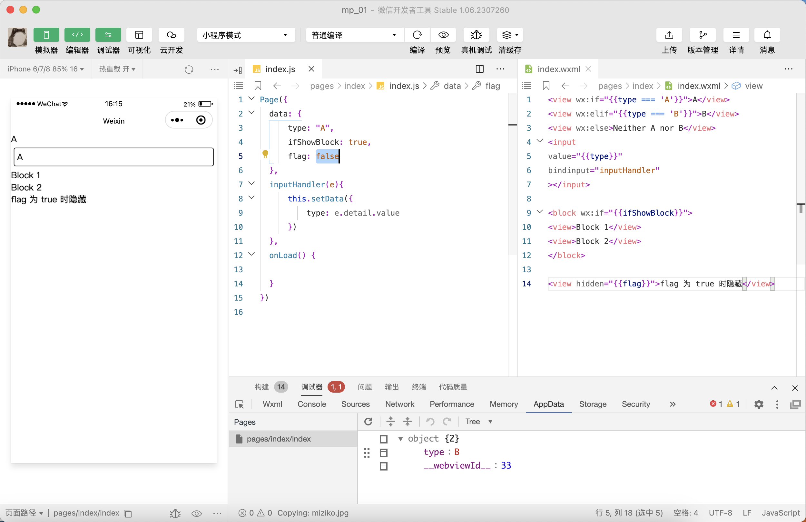

#### 列表渲染
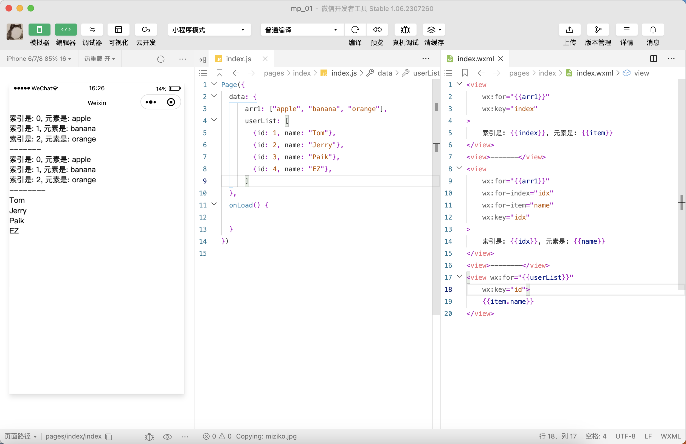

## `WXSS` 模版样式
### `rpx` 单位
> `rpx` 是把设备屏幕在宽度上等分成750份

### 样式导入`@import`
> `@import` 后跟需要导入的外联样式表的**相对路径**，用 `;` 结束

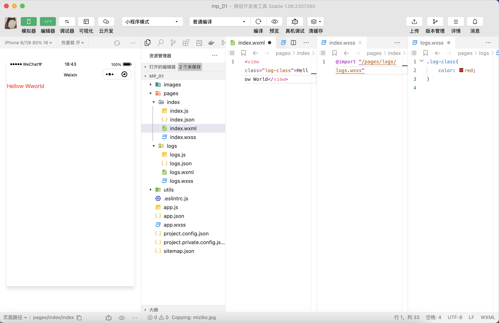

## 全局配置
### 全局配置文件
全局配置文件: `app.json`

### 常用的配置项
#### pages
记录当前小程序所有页面存放路径，谁在第一个谁就是首页
```js
"pages":[
    "pages/index/index",
    "pages/logs/logs"
  ]
```

#### style
`"style": "v2"` 表示启用新版的样式，不想用新版的删了就行

#### window
全局设置小程序外观
##### 小程序窗口组成部分
1. navigationBar 导航栏区域
2. background 背景区域
3. 主体区域
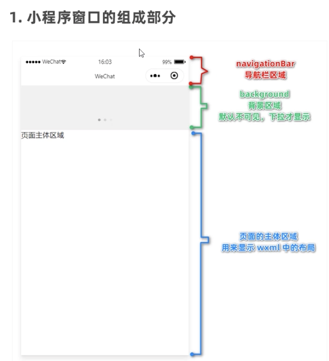

##### window常用配置项
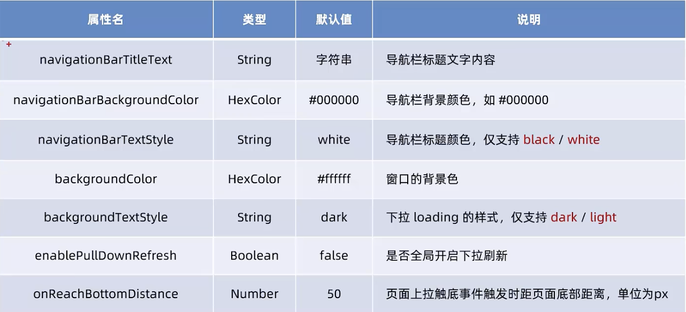
例：修改导航栏标题  
`"navigationBarTitleText": "Linlin",`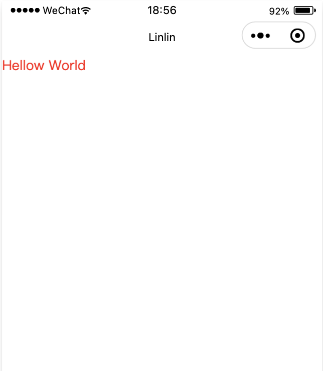

#### tabBar
* tabBar最少两个，最多五个
* tabBar位于顶部时不会显示icon
##### tabBar组成部分
1. backgroundColor
2. selectedIconPath
3. borderStyle
4. selectedColor
5. iconPath
6. color

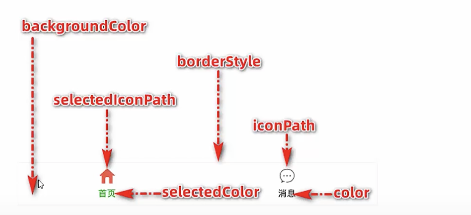

##### tabBar常用配置项
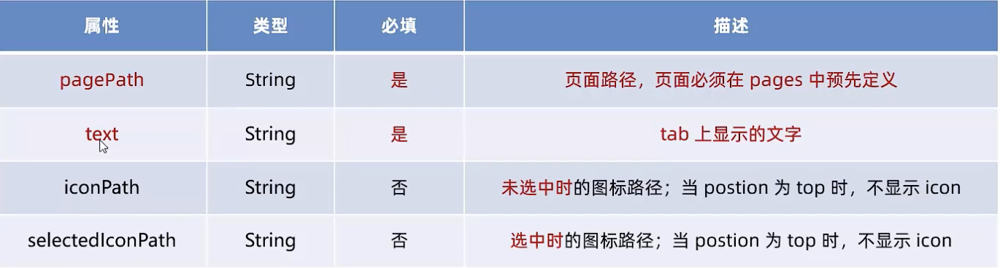
```json
"tabBar": {
    "list": [
        {
            "pagePath": "pages/index/index",
            "text": "index"
        },
        {
            "pagePath": "pages/logs/logs",
            "text": "logs"
        }
    ]
  }
```
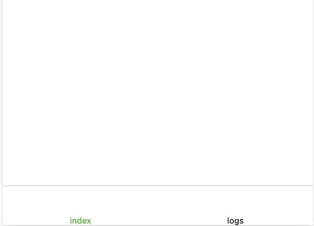

## 页面配置
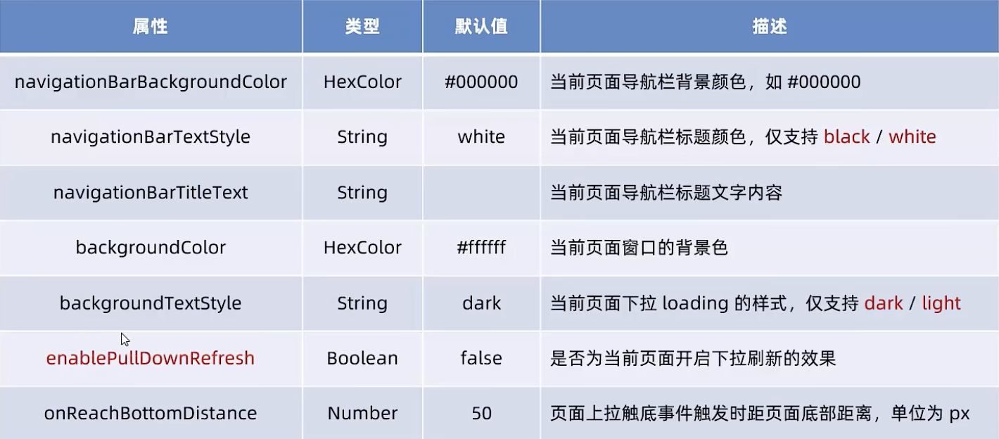

## 网络数据请求
### 网络数据请求的限制
1. 只能请求https接口
2. 必须将接口的域名添加到可信任列表
   1. 要更改合法域名，需要登录到后台->开发->开发设置->服务器域名
   2. 开发者工具里检查域名如图
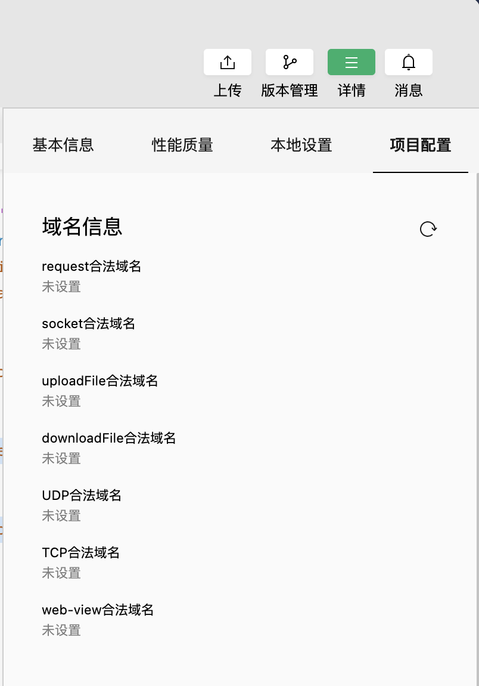

### GET 请求
```js
  getInfo(){
      wx.request({
        url: 'https://jsonplaceholder.typicode.com/posts/1',
        method: 'GET',
        data: {
            name: 'zs',
            age: 20
        },
        success: (res) => {
            console.log(res)
        }
      })
  },
```

### POST 请求
与GET类似，不再赘述

### 注意事项
1. 如果没有https接口，只有http接口，可以跳过检验
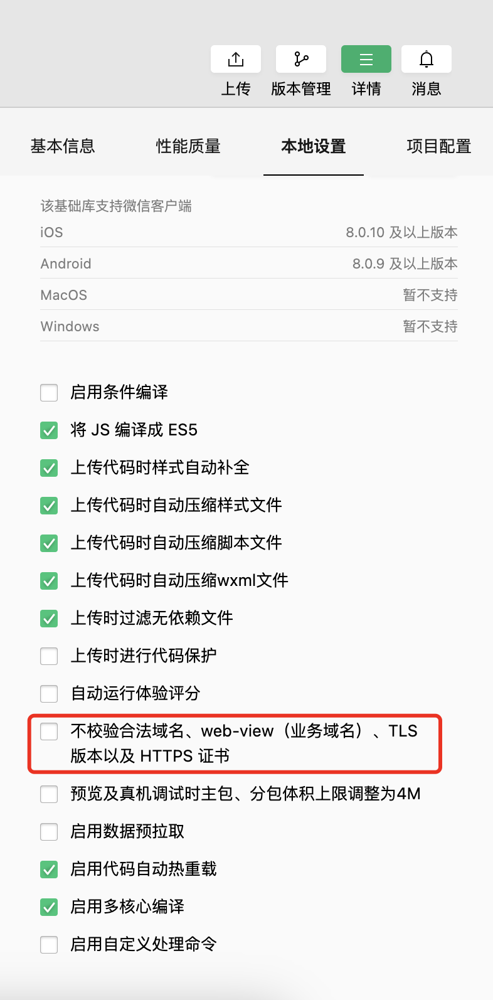

2. 关于跨域和Ajax问题: 小程序不存在跨域问题，发送的请求也不是ajax请求，而是“发起网络数据请求”

