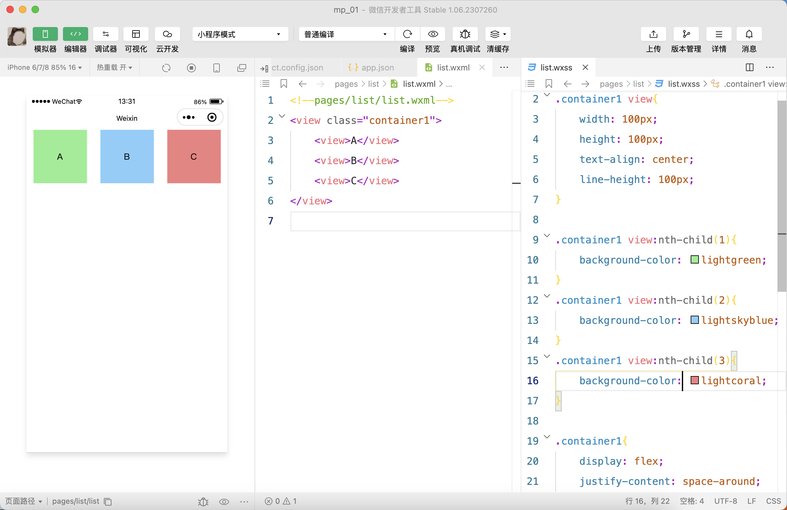
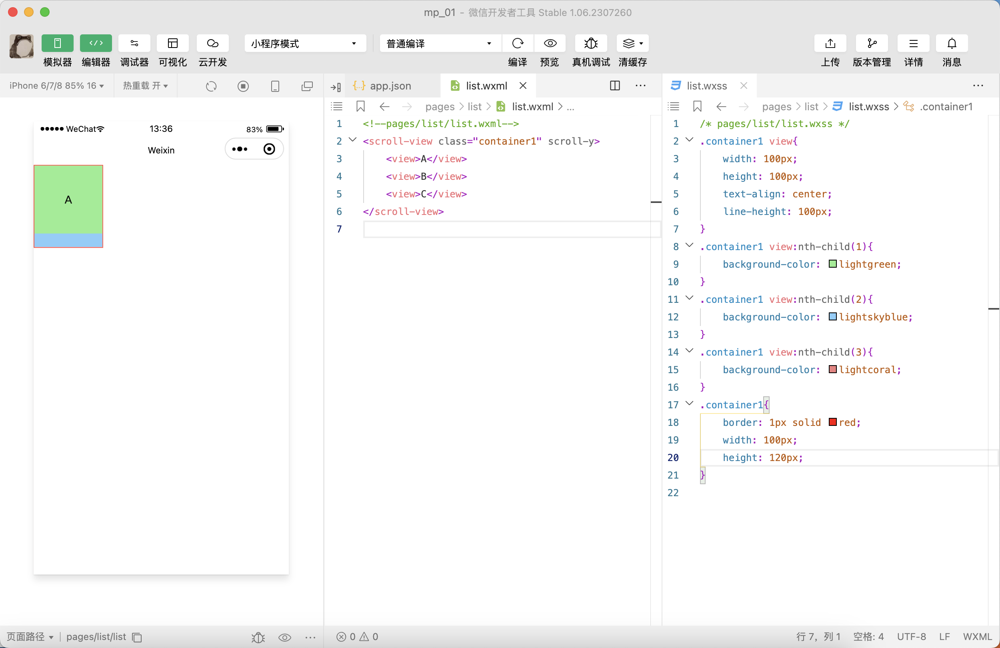
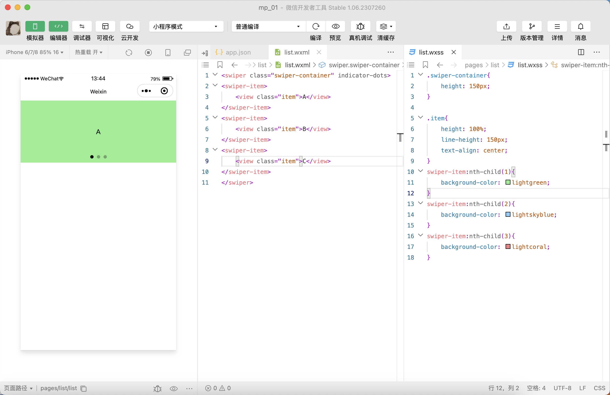
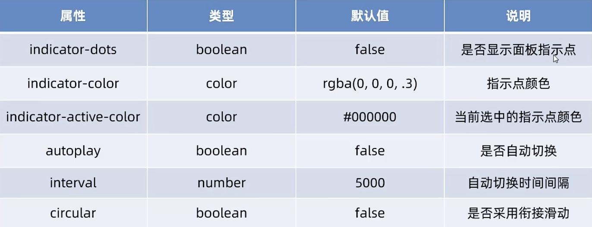
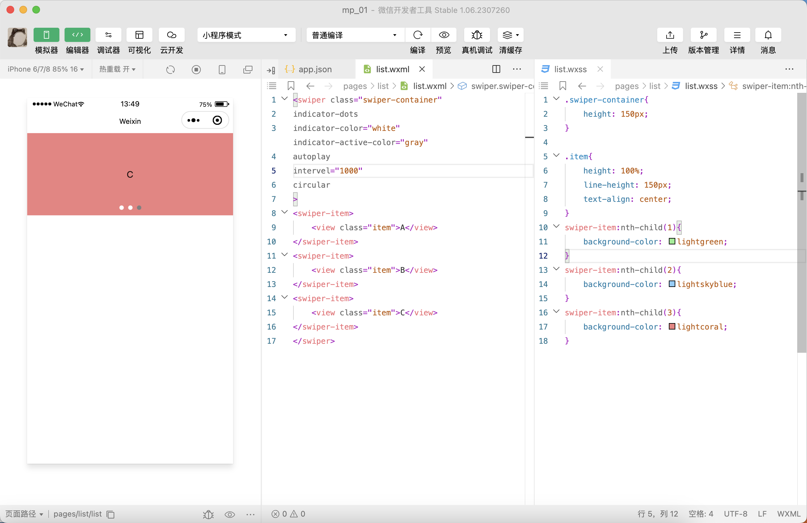
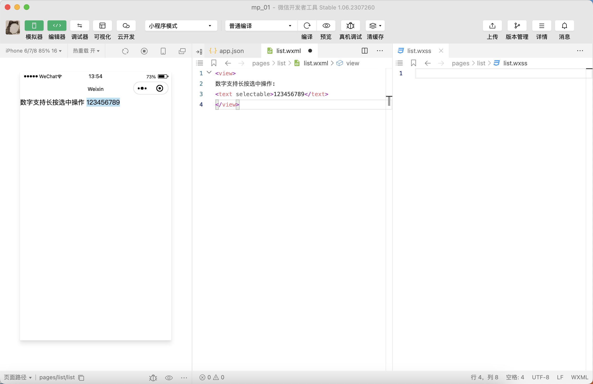
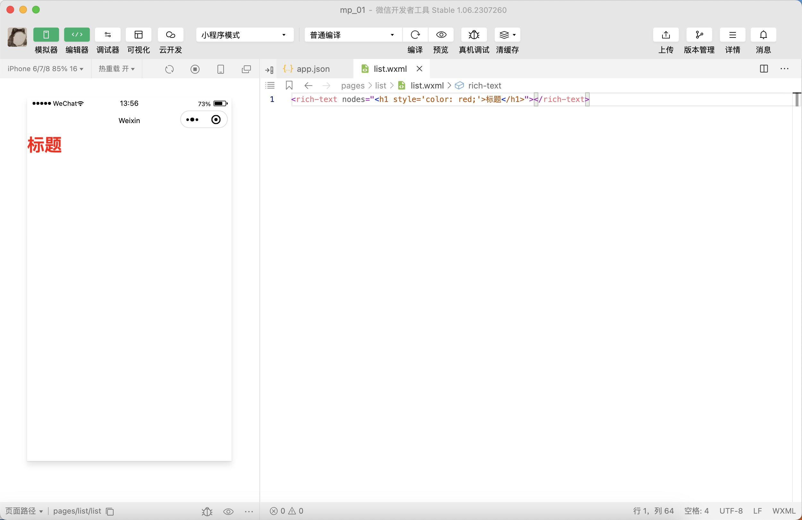
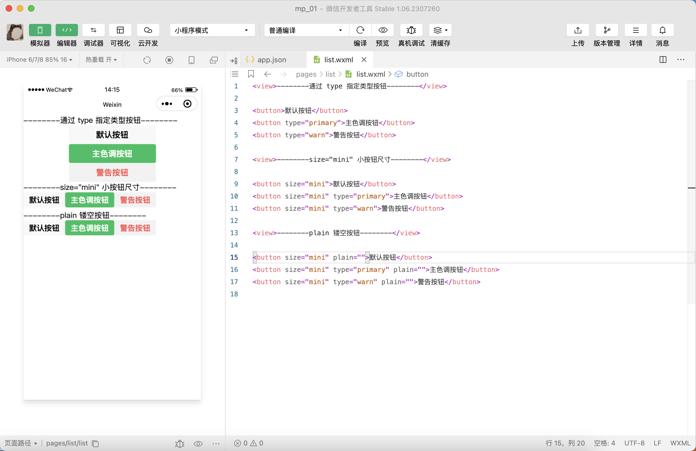
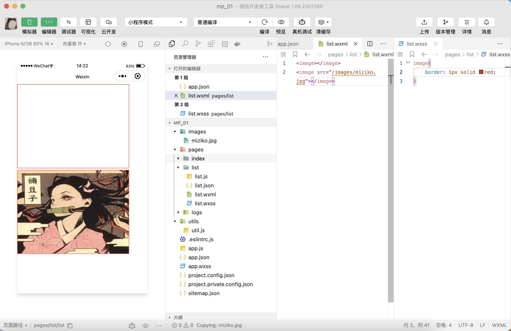
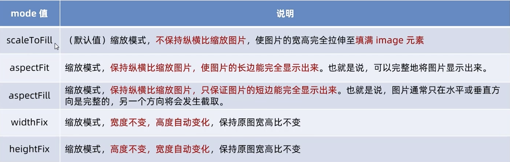

[TOC]
# 小程序组件
## 分类
1. 视图容器
2. 基础内容
3. 表单组件
4. 导航组件
5. 媒体组件
6. map地图组件
7. canvas画布组件
8. 开放能力
9. 无障碍访问

## 视图容器类组件
### `view`
如图，实现flex横向布局


### `scroll-view`
如图，实现纵向移动


### `swiper` 和 `swiper-item`
如图，实现最基本的轮播图


**`swiper` 组件的常用属性**


如图，实现升级版轮播图


## 基础内容组件
### `text`
#### `selectable` 属性


### `rich-text`
```wxml
<rich-text nodes="<h1 style='color: red;'>标题</h1>"></rich-text>
```


## 其他常用组件
### `button`
如图，注意 `type`, `size`, `plain` 三个属性


### `image`
注意文件路径  
`image` 自带宽度和高度


#### `image` 的 `mode` 属性


### `navigator`