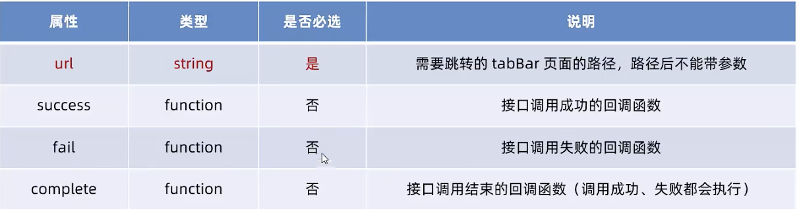

# 小程序 视图与逻辑

[TOC]

## 页面导航
### 声明式导航
#### 跳转到tabBar页面
E.g.: 
```html
<navigator url="/pages/message/message" open-type="switchTab">导航到消息页面</navigator>
```
注意⚠️
1. `url` 表示要跳转页面的地址，必须以 `/` 开头
2. `open-type` 表示跳转的方式，必须为 `swwitchTab`

#### 跳转到非tabBar页面
E.g.: 
```html
<navigator url="/pages/info/info" open-type="navigate">导航到info页面</navigator>
```
注意⚠️
1. `url` 表示要跳转页面的地址，必须以 `/` 开头
2. `open-type` 表示跳转的方式，必须为 `navigate`，**或省略**

#### 后退导航
E.g.: 
```html
<navigator delta="1" open-type="navigateBack">返回上一级</navigator>
```
注意⚠️
1. `delta` 表示后退的层级，**默认是1**
2. `open-type` 表示跳转的方式，必须为 `navigateBack`

### 编程式导航
#### 导航到tabBar页面
`wx.swwitchTab(Object object)`  
`object` 的属性如下


E.g.:  
```js
//home.wxml
<button bind:tap="goToMessage" type="primary">导航到消息页面</button>

//home.js
goToMessage(){
    wx.switchTab({
        url: '/pages/message/message',
    })
},
```

#### 导航到非tabBar页面
`wx.navigateTo(Object object)`
和上面类似，不再赘述

#### 后退导航
`wx.navigateBack(Object object)`

### 导航传参
```js
<!-- 声明式导航 -->
<navigator url="/pages/info/info?name=zs&age=20" open-type="navigate">导航到info页面</navigator>

<!-- 编程式导航 -->
wx.switchTab({
        url: "/pages/info/info?name=zs&age=20",
      })
```

#### onLoad中接收导航参数
```js
  /**
   * 页面的初始数据
   */
  data: {
      query: {}
  },

  /**
   * 生命周期函数--监听页面加载
   */
  onLoad(options) {
      console.log(options)
      this.setData({
          query: options
      })
  },
```

## 页面事件
### 下拉刷新事件
#### 启用下拉刷新
在全局或局部配置(`.json` 文件)里设置 `enablePullDowwnFresh: true` （更推荐用局部的）

#### 配置下拉刷新窗口样式
在全局或局部配置(`.json` 文件)里设置 `backgroundColor` 和 `backgroundTextStyle`
1. `backgroundColor` 窗口背景颜色，仅支持HEX颜色值
2. `backgroundTextStyle` 下拉刷新loading样式， 仅支持 dark 和 light

#### 监听下拉刷新事件
`onPullDowwnRefresh()`
```js
 onPullDownRefresh() {
      console.log("出发了message下拉刷新")
  },
```

#### 停止下拉刷新效果
`wx.stopPullDownRefresh()`

### 上拉触底事件
#### 监听上拉触底事件
`onReachBottom()`
```js
  onReachBottom() {
      console.log("出发了message上拉触底事件")
  },
```

#### 上拉触底距离
在全局或局部配置(`.json` 文件)里设置 `onReachBottomDistance: 50` **默认是50**

## 生命周期


## WXS 脚本
> `wxml` 无法调用在 `.js` 里定义的函数，但可以调用 `wxs` 中定义的函数


### 数据类型
1. `number`
2. `string`
3. `boolean`
4. `object`
5. `function`
6. `array`
7. `date`
8. `regexp`

### 内联wxs
```html
<view>{{m1.toUpper("username")}}</view>
<view>{{m1.showFirstChar("username")}}</view>

<wxs module="m1">
    module.exports.toUpper = function(str){
        return str.toUpperCase()
    }
    module.exports.showFirstChar = function(str){
        return str[0]
    }
</wxs>
```

### 外联
```js
// tool.wxs
function toUpper(str){
    return str.toUpperCase()
}

function showFirstChar(str){
    return str[0]
}

module.exports = {
    toUpper: toUpper,
    showFirstChar: showFirstChar
}

//message.wxml
<view>{{m1.toUpper("username")}}</view>
<view>{{m1.showFirstChar("username")}}</view>

<wxs src="../../utils/tool.wxs" module="m1"></wxs>
```
