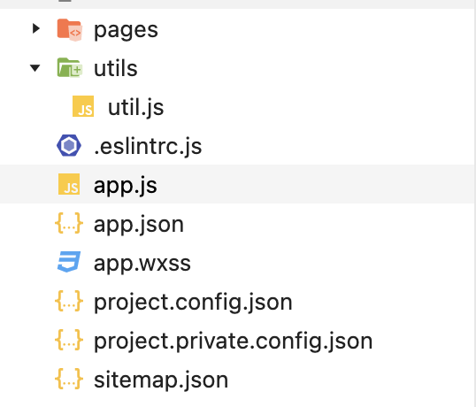
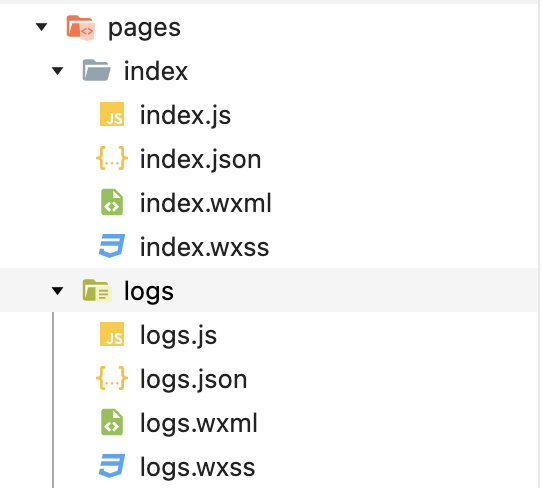

[TOC]
# 小程序项目结构
## 基本结构
每创建一个小程序，就会生成以下几个文件和文件夹  
其中  
* pages 用来存放所有小程序页面
* utils 用来存放工具性质的模块（例如：格式化时间的自定义模块）
* app.js 小程序项目的入口文件
* app.json 小程序项目的全局配置文件
* app.wxss 小程序项目的全局样式文件
* project.config.json 项目配置文件
* sitemap.json 用来配置小程序及其页面是否允许被微信索引



### app.json
```json
{
    // pages 用来记录所有页面的路径
    // 排在第一个的会被当作首页
  "pages":[
    "pages/index/index",
    "pages/logs/logs"
  ],
//   全局定义所有页面的背景颜色、文字颜色等
  "window":{
    "backgroundTextStyle":"light",
    "navigationBarBackgroundColor": "#fff",
    "navigationBarTitleText": "Weixin",
    "navigationBarTextStyle":"black"
  },
//   全局定义样式版本，v2代表最新版
  "style": "v2",
//   用来指明sitemap.json的位置
  "sitemapLocation": "sitemap.json"
}
```

### project.config.json
```json
{
  "description": "项目配置文件",
//   setting 保存了编译的相关配置
  "setting": {
    ...
  },
  "compileType": "miniprogram",
  "condition": {},
  "editorSetting": {
    "tabIndent": "insertSpaces",
    "tabSize": 2
  },
  "libVersion": "2.19.4",
  "packOptions": {
    "ignore": [],
    "include": []
  },
//   小程序id
  "appid": "wx0859f42017cf2dbb"
}
```

### sitemap.json
```json
{
  "desc": "关于本文件的更多信息，请参考文档 https://developers.weixin.qq.com/miniprogram/dev/framework/sitemap.html",
  "rules": [{
    // allow 表示可以被索引
  "action": "allow",
//   *表示所有页面
  "page": "*"
  }]
}
```

## 页面结构

官方建议把页面都放在pages文件夹里，每个页面单独放一个文件夹，每个文件夹里都有四个文件

* .js 页面的脚本文件，存放页面的数据，事件处理函数等
* .json 页面的配置文件，配置窗口的外观，表现等
* .wxss 页面的模版结构文件
* .wxml 页面的样式表文件

> .json 里的配置会覆盖掉app.json里的全局配置